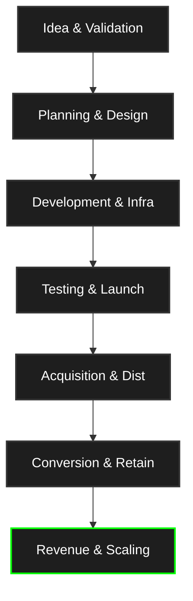

<div align="center">

```text
  ____  ____      _    ___ _   _ ___    _    ____ 
 | __ )|  _ \    / \  |_ _| \ | |_ _|  / \  / ___|
 |  _ \| |_) |  / _ \  | ||  \| || |  / _ \| |    
 | |_) |  _ <  / ___ \ | || |\  || | / ___ \ |___ 
 |____/|_| \_\/_/   \_\___|_| \_|___/_/   \_\____|
```

# SaaS-Blueprint: The Vibe-Coding Command Center

[](https://opensource.org/licenses/MIT)
[](http://makeapullrequest.com)
[](#)

</div>

<br/>

## 📑 Table of Contents

- [🚀 What is this project?](#-what-is-this-project)
- [📂 The Playbook Library](#-the-playbook-library-dummy-data)
- [🔄 The SaaS Lifecycle](#-the-saas-lifecycle)
- [🎯 Who is it for?](#-who-is-it-for)
- [💡 Why this exists](#-why-this-exists--why-i-made-it)
- [🏆 Best Use Cases](#-best-use-cases)
- [🤖 The "Origin" Prompt](#-the-origin-prompt)
- [🤝 Contribute & Share](#-contribute--share)

## 🚀 What is this project?

The SaaS-Blueprint is a comprehensive, modular "Operating System" designed to guide the entire lifecycle of a Software as a Service (SaaS) startup. It acts as an action-oriented, folder-based repository that organizes every phase of building a software business—from initial idea validation and MVP design, to global scaling and exit strategy.

Inside each directory, you'll find dedicated `PLAYBOOK.md` files containing specific objectives, the required mindset, brutally simple action steps, and AI prompts tailored to specific growth, technical, and marketing modules.

## 📂 The Playbook Library (`Dummy Data/`)

The `Dummy Data/` directory is not just "sample data" it is a **modular, plug-and-play AI playbook library**. Each folder is a specialized module containing its own `PLAYBOOK.md` designed to be interpreted by an AI agent (like Cursor, Gemini, or Claude).

- **Plug & Play:** Download the `Dummy Data/` folder, plug it into your AI of choice, and watch it generate an entire, verified plan to build a **$10K/MRR SaaS**.
- **Community-Driven:** We aim to make this the world's most complete, action-oriented playbook for SaaS development.
- **Contribute:** Have a high-leverage strategy for SEO, Conversion, or Scaling? **Fork this repo and open a PR.** If it moves the needle, we want it in the master playbook.

## 🔄 The SaaS Lifecycle



## 🎯 Who is it for?

This repository is tailor-made for:

- **Solo Founders & Indie Hackers** trying to build a scalable business without a large team.
- **Non-Technical Entrepreneurs** leveraging AI ("Vibe-Coding") to bridge the technical gap and build products themselves.
- **Developers** seeking a structured, step-by-step roadmap to launch, market, and monetize their side projects, rather than just coding features endlessly.
- Anyone overwhelmed by the chaotic journey of building a startup who needs a master plan to execute on.

## 💡 Why this exists & Why I made it

Building a SaaS is messy. There are thousands of tasks across coding, marketing, sales, and support. I built this repository to act as a **Command Center** that eliminates decision fatigue. Instead of wondering "what should I do next?", you simply open the playbook for your current phase (e.g., *Launch -> Product Hunt* or *Development -> Authentication*) and follow the exact instructions and AI prompts provided.

It exists to enforce a core philosophy:

- **Speed over Perfection:** "Speed is a feature."
- **Vibe Coding:** Leveraging AI (like Cursor, Gemini, Claude) to code, write, and execute drastically faster.
- **Brutal Simplicity:** Stripping away nice-to-haves and focusing strictly on what drives ARR (Annual Recurring Revenue), growth, and retention.
- **Automation First:** Automate what can be automated, delegate what must be, and code the rest with AI.

## 🏆 Best Use Cases

- **30-Day Sprints to Revenue:** Following the playbooks sequentially to launch an MVP and get the first paying customers within a month.
- **AI-Assisted Execution:** Feeding the provided AI prompts in the `PLAYBOOK.md` files directly into AI models to generate boilerplate code, email sequences, or landing page copy.
- **Project Management:** Using the directory structure as a Kanban-style roadmap to track what has been validated, built, and optimized.

## 🤖 The "Origin" Prompt

Want to recreate this exact system structure for your own project without cloning the repository? Just paste the [PROMPT](SaaS-blueprint-prompt.md) into ChatGPT, Claude, or Gemini.

This directory is a **SaaS Command Center**, NOT an APP. It's a comprehensive playbook and operating system designed for building, launching, and scaling a SaaS APP covering from MVP to Mass Scale. It is structured as a chronological and functional roadmap, containing over 80 specialized directories, each with its own `PLAYBOOK.md`.

## Key Files

- **README.md**: The entry point for the Command Center, explaining the overall structure and the "Master Plan."
- **.env**: Contains environment variables and placeholders for API keys (e.g., OpenAI, Stripe).
- **PLAYBOOK.md (various subfolders)**: Each functional area (Idea, Validation, Planning, etc.) contains a specific playbook with objectives, actions, and suggested automations.

- Create the following folder and file structure exactly:

```markdown

📂 {APP_NAME}
┃
┣ 📂 Idea
┃ ┣ 📂 Problem Discovery
┃ ┣ 📂 Market Research
┃ ┣ 📂 Niche Selection
┃ ┣ 📂 Competitor Analysis
┃ ┗ 📂 Opportunity Mapping
┃
┣ 📂 Validation
┃ ┣ 📂 Customer Interviews
┃ ┣ 📂 Landing Page Test
┃ ┣ 📂 Waitlist
┃ ┣ 📂 Pre Sales
┃ ┗ 📂 Demand Testing
┃
┣ 📂 Planning
┃ ┣ 📂 Product Roadmap
┃ ┣ 📂 Feature Prioritization
┃ ┣ 📂 MVP Scope
┃ ┣ 📂 Tech Stack
┃ ┗ 📂 Development Plan
┃
┣ 📂 Design
┃ ┣ 📂 Wireframes
┃ ┣ 📂 UI Design
┃ ┣ 📂 UX Flows
┃ ┣ 📂 Prototype
┃ ┗ 📂 Design System
┃
┣ 📂 Development
┃ ┣ 📂 Frontend
┃ ┣ 📂 Backend
┃ ┣ 📂 APIs
┃ ┣ 📂 Database
┃ ┣ 📂 Authentication
┃ ┗ 📂 Integrations
┃
┣ 📂 Infrastructure
┃ ┣ 📂 Cloud Hosting
┃ ┣ 📂 DevOps
┃ ┣ 📂 CI CD
┃ ┣ 📂 Monitoring
┃ ┗ 📂 Security
┃
┣ 📂 Testing
┃ ┣ 📂 Unit Testing
┃ ┣ 📂 Integration Testing
┃ ┣ 📂 Bug Fixing
┃ ┣ 📂 Performance Testing
┃ ┗ 📂 Beta Testing
┃
┣ 📂 Launch
┃ ┣ 📂 Landing Page
┃ ┃ ┣ 📂 Legal
┃ ┃ ┣ 📂Terms of use 
┃ ┃ ┣ 📂Privacy Policy 
┃ ┃ ┗ 📂 Cookie Notice
┃ ┣ 📂 Product Hunt
┃ ┣ 📂 Beta Users
┃ ┣ 📂 Early Adopters
┃ ┗ 📂 Public Release
┃
┣ 📂 Acquisition
┃ ┣ 📂 SEO Wins
┃ ┣ 📂 Content Marketing
┃ ┣ 📂 Social Media
┃ ┣ 📂 Cold Email
┃ ┣ 📂 Influencer Outreach
┃ ┗ 📂 Affiliate Marketing
┃
┣ 📂 Distribution
┃ ┣ 📂 Directories
┃ ┣ 📂 SaaS Marketplaces
┃ ┣ 📂 Communities
┃ ┣ 📂 Partnerships
┃ ┗ 📂 Integrations
┃
┣ 📂 Conversion
┃ ┣ 📂 Sales Funnel
┃ ┣ 📂 Free Trial
┃ ┣ 📂 Freemium Model
┃ ┣ 📂 Pricing Strategy
┃ ┗ 📂 Checkout Optimization
┃
┣ 📂 Revenue
┃ ┣ 📂 Subscriptions
┃ ┣ 📂 Upsells
┃ ┣ 📂 Add-ons
┃ ┣ 📂 Annual Plans
┃ ┗ 📂 Enterprise Deals
┃
┣ 📂 Analytics
┃ ┣ 📂 User Tracking
┃ ┣ 📂 Funnel Analysis
┃ ┣ 📂 Cohort Analysis
┃ ┣ 📂 KPI Dashboard
┃ ┗ 📂 AB Testing
┃
┣ 📂 Retention
┃ ┣ 📂 User Onboarding
┃ ┣ 📂 Email Automation
┃ ┣ 📂 Customer Support
┃ ┣ 📂 Feature Adoption
┃ ┗ 📂 Churn Reduction
┃
┣ 📂 Growth
┃ ┣ 📂 Referral Programs
┃ ┣ 📂 Community Building
┃ ┣ 📂 Product Led Growth
┃ ┣ 📂 Viral Loops
┃ ┗ 📂 Expansion Strategy
┃
┗ 📂 Scaling
  ┣ 📂 Automation
  ┣ 📂 Hiring
  ┣ 📂 Systems
  ┣ 📂 Global Expansion
  ┗ 📂 Exit Strategy

```

## 📝 License

This project is licensed under the MIT License - see the [LICENSE](LICENSE) file for details.

## 🤝 Contribute & Share

Building your SaaS with this Command Center? Let the world know and help us improve the playbook.

- Contributions are welcome! Please [Read the Contributing Guide](CONTRIBUTING.md) and open a PR.
- **Want to show off your build?** [Share it on X / Twitter](https://twitter.com/intent/tweet?text=Just%20found%20the%20ultimate%20AI-assisted%20SaaS%20Command%20Center.%20A%20plug-and-play%20playbook%20for%20Vibe-Coding%20your%20way%20to%20MRR.%20%F0%9F%9A%80%20https://github.com/tuliosousapro/SaaS-blueprint)

## 🙏 Acknowledgments

- Shout out to @[hridoyreh](https://x.com/hridoyreh) for the folder blueprint.

---
<div align="center">
  <b>Since 2025 | <a href="https://github.com/tuliosousapro">Túlio Sousa</a></b><br><br>
  <a href="https://x.com/tuliosousapro"></a>
  <br><br>
  <i>Stay focused. Ship it.</i>
</div>
